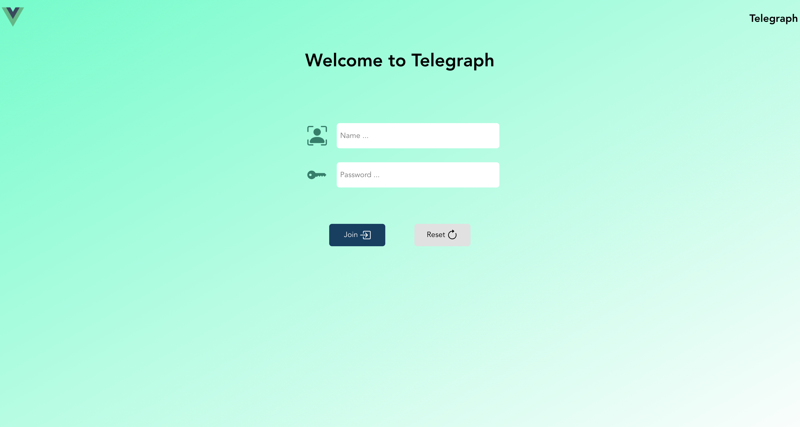
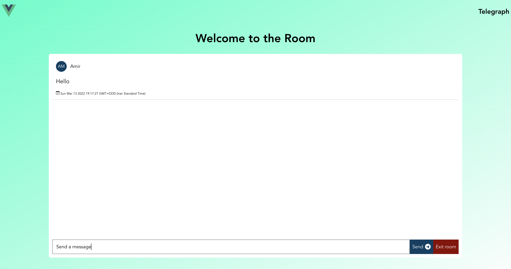

# Telegraph-Frontend

This is a vue-client to test our telegraph service.




## Project setup
Install node modules:
```
npm install
```

Run client:
```angular2html
make dev
```

### Customize configuration
See [Configuration Reference](https://cli.vuejs.org/config/).
